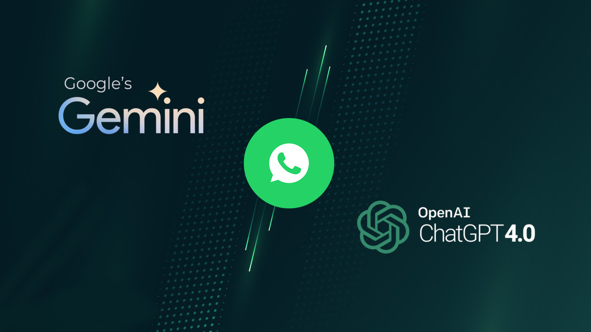

# Whastapp BOT AI OpenAI & Gemini (Node)

 Whatsapp Bot AI Node Project integrated by OpenAI and Gemini. 


 
## Installation
```sh
git clone https://github.com/HyTech-Group/wabot-ai.git
cd wabot-ai
npm i wabot-ai
```

## Setting .env
```sh
PHONE = "628xxxxxxxx"

OPENAI_APIKEY = "apiKey OpenAI"
MODEL_OPENAI = "gpt-3.5-turbo-1106"
COMMAND_OPENAI = "Command the OpenAI"
PREFIX_OPENAI = ".openai"

GEMINI_APIKEY = "apiKey Gemini"
MODEL_GEMINI = "gemini-pro"
COMMAND_GEMINI = "Command the GeminiAI"
PREFIX_GEMINI = ".gemini"
```
## Implementation index.js
```
require('dotenv').config();
const { HyWaBot, HytechMessages, HytechHandle, HytechHandleGemini } = require('wabot-ai');
const data = {
    phoneNumber: process.env.PHONE,
    sessionId: 'session',
    useStore: true,
};
const bot = new HyWaBot(data);
bot.start()
    .then(sock => {
        sock.ev.on('messages.upsert', async chatUpdate => {
            try {
                let m = chatUpdate.messages[0];
                if (!m.message) return;
                const result = await HytechMessages(m);
                console.log('Processed message:', result);
                let cmd;
                if (result.chatsFrom === 'private') {
                    cmd = result.message;
                } else if (result.chatsFrom === 'group') {
                    cmd = result.participant ? result.participant.message : result.message;
                }
                if (cmd.startsWith(process.env.PREFIX_OPENAI)) {
                    const messageToProcess = cmd.replace(process.env.PREFIX_OPENAI, '').trim();
                    const response = await HytechHandle(messageToProcess);
                    sock.sendMessage(result.remoteJid, { text: response });
                }
                if (cmd.startsWith(process.env.PREFIX_GEMINI)) {
                    const messageToProcess = cmd.replace(process.env.PREFIX_GEMINI, '').trim();
                    const response = await HytechHandleGemini(messageToProcess);
                    sock.sendMessage(result.remoteJid, { text: response });
                }
            } catch (error) {
                console.error('Error processing message:', error);
            }
        });
    })
    .catch(error => {
        console.error('Error starting bot:', error);
    });
```

## Run
`node index.js`

## Get ApiKey
<p>Official Site OpenAI: <a href="https://openai.com/">https://openai.com</a>
<br>
Official Site Gemini: <a href="https://aistudio.google.com/">https://aistudio.google.com</a></p>

## Ads Ons
Add the translation feature, before starting you need to run the <a href="https://github.com/fitri-hy/api-translate-express.git">Translate Express API</a> server first.

```
// add endpoint url
const ApiTranslate = 'http://localhost:5000/translate?text='; // your translate endpoint api

// add perfix translate on bot
if (cmd.startsWith('.id-en')) { // indonesia to english
    const messageToProcess = cmd.replace('.id-en', '').trim();
    const response = await fetch(`${ApiTranslate}${encodeURIComponent(messageToProcess)}&from=id&to=en`) // adjust language code
        .then((res) => res.json())
        .then((data) => data.translation);
    sock.sendMessage(result.remoteJid, {
        text: response
    });
}
if (cmd.startsWith('.en-id')) { // english to indonesia
    const messageToProcess = cmd.replace('.en-id', '').trim();
    const response = await fetch(`${ApiTranslate}${encodeURIComponent(messageToProcess)}&from=en&to=id`) // adjust language code
        .then((res) => res.json())
        .then((data) => data.translation);
    sock.sendMessage(result.remoteJid, {
        text: response
    });
}
```
Discover more languages <a href="https://www.ibm.com/docs/en/cognos-controller/10.4.2?topic=codes-language">Click Here</a>

Don't forget to give stars

Follow Me: <a href="https://hy-tech.my.id/docs">FOLLOW</a>
